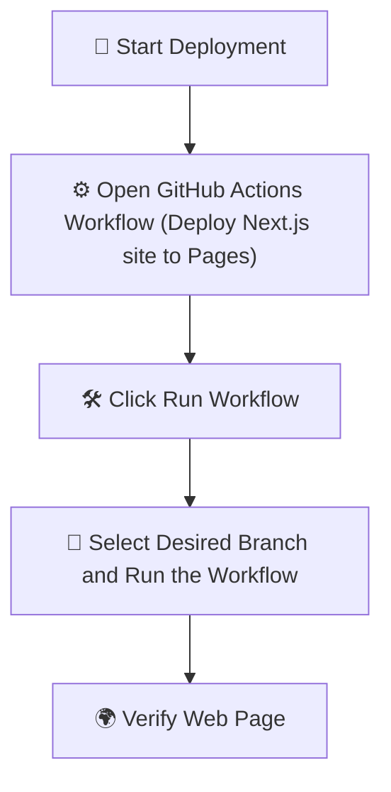

<!-- ARC REACTOR -->

# ❤️💛 IRON MAN 💛❤️

### ⚡ Powered by GitHub Actions ⚡

# ⚡ About This Project

- A **testing website** built in the **Iron Man Theme** ❤️💛 inspired by futuristic UI, Tony Stark technology, and J.A.R.V.I.S aesthetics.

- This repository is 

- this Web Page can be deployed using vercel and Github Actions
- I have created a new repo that runs with **"VERCEL"** 

---

# 🚀 How to Deploy the Webpage using Github Pages
## GitHub Actions

- One of the ways to deploy the webpage is through GitHub Actions workflows.

- I have already created a workflow.

### ⚡ Deployment Workflow

### 🌍 Verify Deployment

Click the webpage badge to verify deployment:

---

| Mark | Nickname / Variant | First Movie Appearance | Year |
|-------|-------------------|-------------------------|------|
| I | Prototype Cave Suit | Iron Man | 2008 |
| II | Prototype Silver Suit | Iron Man | 2008 |
| III | Classic Red & Gold | Iron Man | 2008 |
| IV | — | Iron Man 2 | 2010 |
| V | Suitcase Suit | Iron Man 2 | 2010 |
| VI | Triangle Arc Reactor Suit | Iron Man 2 | 2010 |
| VII | Battle of New York Suit | The Avengers | 2012 |
| VIII | — | Iron Man 3 | 2013 |
| IX | — | Iron Man 3 | 2013 |
| X | — | Iron Man 3 | 2013 |
| XI | — | Iron Man 3 | 2013 |
| XII | — | Iron Man 3 | 2013 |
| XIII | — | Iron Man 3 | 2013 |
| XIV | — | Iron Man 3 | 2013 |
| XV | Sneaky (Stealth Suit) | Iron Man 3 | 2013 |
| XVI | Nightclub | Iron Man 3 | 2013 |
| XVII | Heartbreaker | Iron Man 3 | 2013 |
| XVIII | Cassanova | Iron Man 3 | 2013 |
| XIX | Tiger | Iron Man 3 | 2013 |
| XX | Python | Iron Man 3 | 2013 |
| XXI | Midas | Iron Man 3 | 2013 |
| XXII | Hot Rod | Iron Man 3 | 2013 |
| XXIII | Shades | Iron Man 3 | 2013 |
| XXIV | Tank | Iron Man 3 | 2013 |
| XXV | Striker (Heavy Construction) | Iron Man 3 | 2013 |
| XXVI | Gamma | Iron Man 3 | 2013 |
| XXVII | Disco | Iron Man 3 | 2013 |
| XXVIII | Jack | Iron Man 3 | 2013 |
| XXIX | Fiddler | Iron Man 3 | 2013 |
| XXX | Blue Steel | Iron Man 3 | 2013 |
| XXXI | Piston | Iron Man 3 | 2013 |
| XXXII | Romeo | Iron Man 3 | 2013 |
| XXXIII | Silver Centurion | Iron Man 3 | 2013 |
| XXXIV | Southpaw | Iron Man 3 | 2013 |
| XXXV | Red Snapper | Iron Man 3 | 2013 |
| XXXVI | Peacemaker | Iron Man 3 | 2013 |
| XXXVII | Hammerhead (Deep Sea Suit) | Iron Man 3 | 2013 |
| XXXVIII | Igor | Iron Man 3 | 2013 |
| XXXIX | Gemini / Starboost | Iron Man 3 | 2013 |
| XL | Shotgun | Iron Man 3 | 2013 |
| XLI | Bones | Iron Man 3 | 2013 |
| XLII (42) | Prodigal Son | Iron Man 3 | 2013 |
| XLIII (43) | — | Avengers: Age of Ultron | 2015 |
| XLIV (44) | Hulkbuster | Avengers: Age of Ultron | 2015 |
| XLV (45) | — | Avengers: Age of Ultron | 2015 |
| XLVI (46) | Civil War Suit | Captain America: Civil War | 2016 |
| XLVII (47) | Homecoming Suit | Spider-Man: Homecoming | 2017 |
| XLVIII (48) | Hulkbuster 2.0 | Avengers: Infinity War | 2018 |
| XLIX (49) | Rescue Armor (Pepper Potts) | Avengers: Endgame | 2019 |
| L (50) | Bleeding Edge / Nanotech Suit | Avengers: Infinity War | 2018 |
| LI–LXXXIV (51–84) | Unseen Upgraded Armors | Off-screen development | — |
| LXXXV (85) | Final Nanotech Armor | Avengers: Endgame | 2019 |

---
# 👨‍💻 Author

### - ⚡Venkat Nishit Kureti
---

